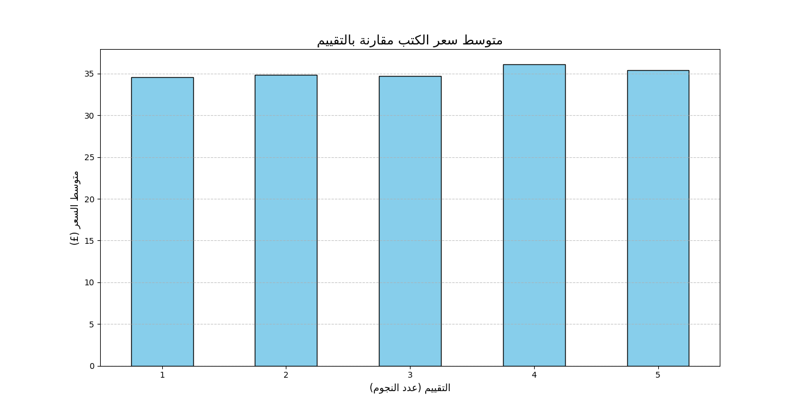

# 📚 Automated Book Market Analyzer

## 📝 Overview
This project is a complete data pipeline tool designed to identify **undervalued assets** in the book market. It automates the process of scraping data from an online bookstore, cleaning it, and performing financial analysis to find high-quality books (5-star rating) selling at low prices.

## 🚀 Key Features
* **Automated Web Scraping:** Crawls through 50 pages to extract data for 1000+ books using `Requests` & `BeautifulSoup`.
* **Data Cleaning & Engineering:** Converts currency strings to floats, maps text ratings (e.g., "Five") to integers, and handles missing values.
* **Financial Analysis:** Uses `Pandas` to calculate market averages and filter for "Golden Opportunities" (High Rating + Low Price).
* **Visualization:** Generates a bar chart using `Matplotlib` to visualize the correlation between price and quality.
* **Arabic Support:** Implemented text reshaping to correctly display Arabic titles and labels in charts.

## 📂 Project Structure
* `data_collector.py`: The main bot that collects data from the web.
* `analysis.py`: The analytical engine that processes data and generates the chart.
* `books_data.xlsx`: The raw dataset (1000 rows).
* `best_deals_report.xlsx`: The final report containing the top investment opportunities.
* `analysis_result.png`: Visual chart summarizing the market findings.

## 🛠️ Technologies Used
* **Python 3.12**
* **Pandas** (Data Manipulation)
* **BeautifulSoup4** (Web Scraping)
* **Matplotlib** (Data Visualization)
* **Arabic-Reshaper & Python-Bidi** (Text formatting)

## 📊 Results & Insights
The analysis revealed a **market inefficiency**: the price of books does not correlate with their rating. This allowed the system to identify over 50 "hidden gems" (5-star books under £15).

### Market Visualization:

---
*Created by [Hamza Delleci] (@hamzadeeci) - Quantitative Economics Student | Python & Data Analysis.*

